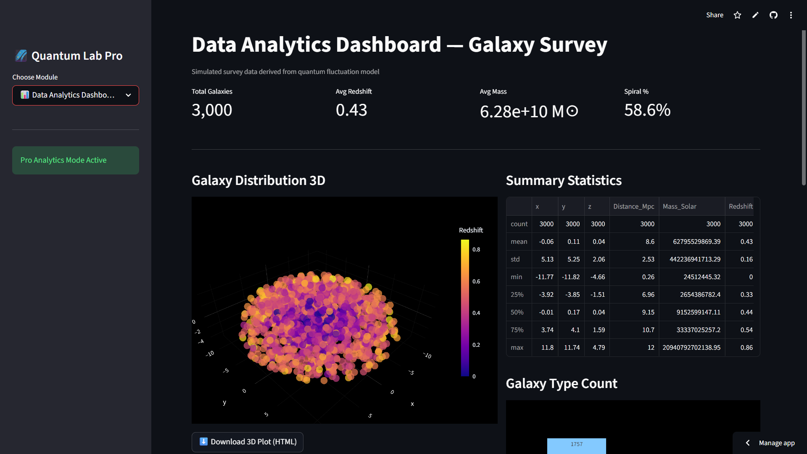
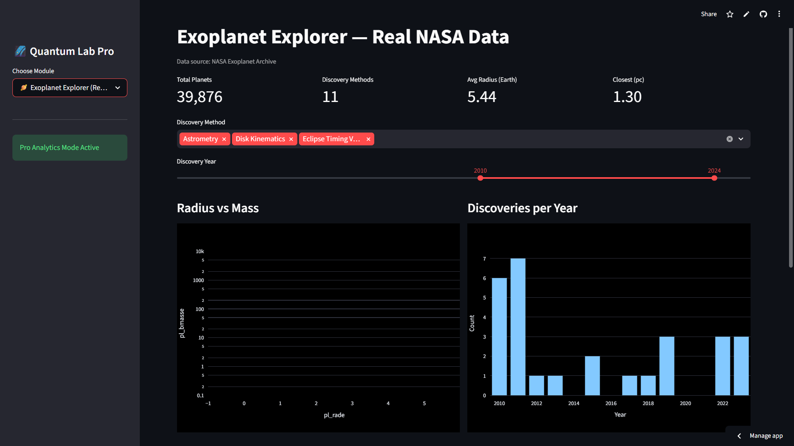
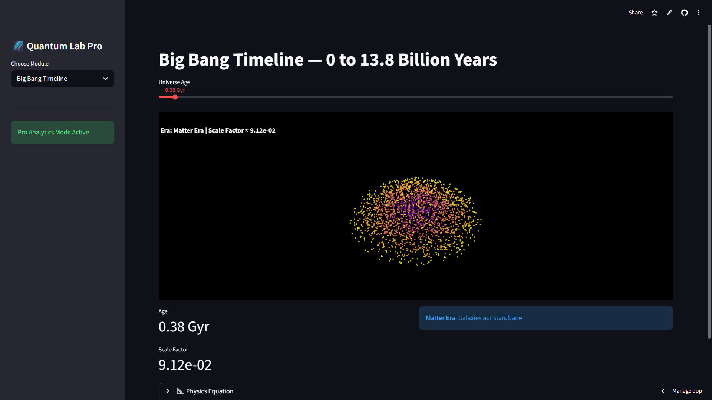
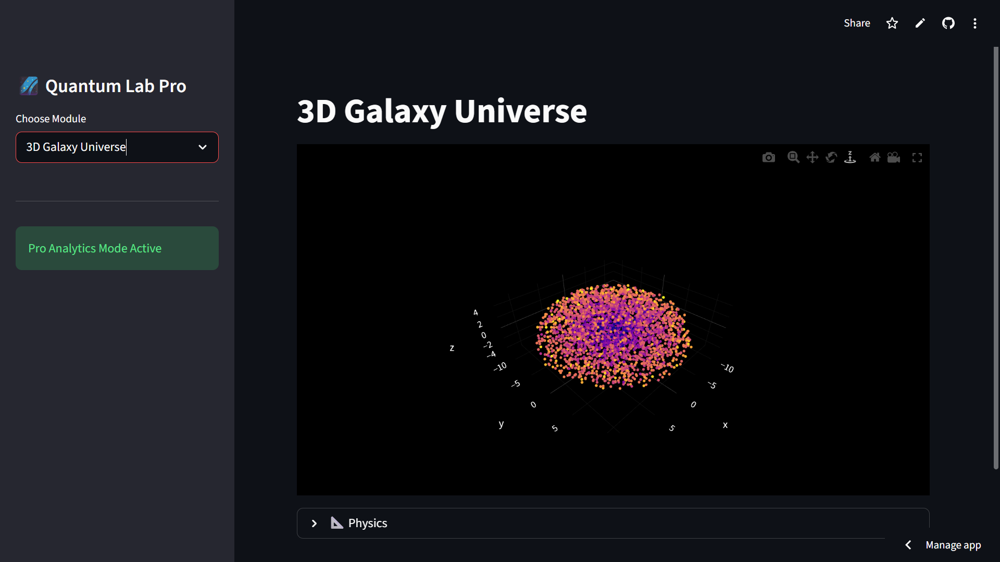
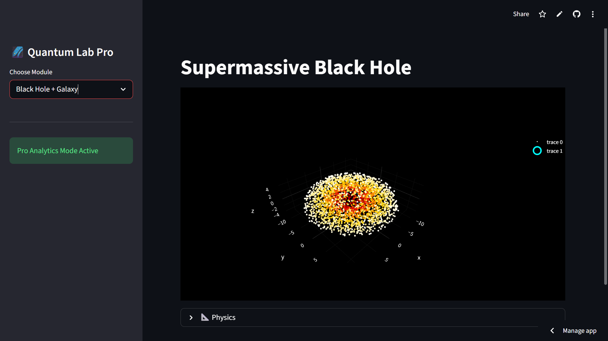

# 🌌 Quantum Universe Pro — Data Analytics + Real NASA Data

[](https://quantum-universe-pro-kkgdt8cr5vauuelcexejqm.streamlit.app/)
[](https://www.python.org/)
[](https://streamlit.io)
[](https://plotly.com)
[](LICENSE)

An interactive data analytics portfolio project that blends **real NASA exoplanet data** with quantum cosmology simulations. Built to showcase EDA, visualization and storytelling skills for Data Analytics roles.

---

## 📸 Screenshots

### 1. Data Analytics Dashboard — Galaxy Survey

**KPIs:** Total Galaxies 3,000 | Avg Redshift 0.43 | Avg Mass 6.28e+10 M☉ | Spiral % 58.6%

### 2. Exoplanet Explorer — Real NASA Data

**KPIs:** Total Planets 39,876 | Discovery Methods 11 | Avg Radius 5.44 | Closest 1.30 pc

### 3. Big Bang Timeline — 0 to 13.8 Billion Years

Interactive slider with Era detection and Scale Factor

### 4. 3D Galaxy Universe

3,000 galaxies with redshift coloring

### 5. Supermassive Black Hole

Galaxy distribution with central black hole

---

## ✨ Features

### 📊 Data Analytics Dashboard
- Galaxy Distribution 3D interactive scatter
- Summary Statistics table
- Galaxy Type Count
- Download 3D Plot as HTML + Dataset as CSV

### 🪐 Exoplanet Explorer
- Live data from NASA Exoplanet Archive
- Filter by Discovery Method
- Discovery Year slider 2010-2024
- Radius vs Mass scatter plot
- Discoveries per Year bar chart

### 🔭 Cosmology Simulations
- Big Bang Timeline
- 3D Galaxy Universe
- Supermassive Black Hole
- Schrödinger Wave Packet
- Cosmic Inflation
- Quantum Fluctuations + CMB

---

## 🛠️ Tech Stack

- Python 3.10+
- Streamlit
- Plotly
- Pandas / NumPy
- NASA Exoplanet Archive API

---

## 🚀 Run Locally

```bash
git clone https://github.com/akash1234-design/quantum-universe-pro.git
cd quantum-universe-pro
pip install -r requirements.txt
streamlit run app_web.py
